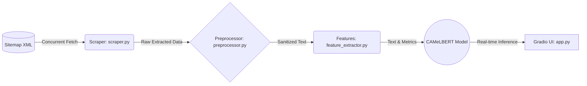

<h1 align="center">🤖 Arabic News Scraper & NLP Pipeline</h1>

<p align="center">
  <strong>نظام متكامل لاستخراج وتصنيف الأخبار العربية باستخدام معالجة اللغات الطبيعية ونماذج الـ Transformers</strong>
</p>

<p align="center">
  <a href="https://huggingface.co/spaces/Alhareth/arabic-news-classifier">
    
  </a>
  <a href="https://github.com/Alhareith/arabic-news-classifier/stargazers">
    
  </a>
  <a href="https://github.com/Alhareith/arabic-news-classifier/network/members">
    
  </a>
</p>

<p align="center">
  
  
  
  
  
  
</p>

---

## ⚡ لمحة سريعة | Overview

<table align="right" dir="rtl" width="100%">
  <thead>
    <tr>
      <th align="right" width="25%">الميزة</th>
      <th align="right" width="75%">التفاصيل التقنية</th>
    </tr>
  </thead>
  <tbody>
    <tr>
      <td><b>النموذج اللغوي (Model)</b></td>
      <td>نموذج CAMeLBERT مخصص للتصنيف متعدد الفئات (Multi-class)</td>
    </tr>
    <tr>
      <td><b>الأداء (Performance)</b></td>
      <td>دقة إجمالية تصل إلى <b>82.33%</b> و<b>F1-Macro = 81.56%</b> (اعتماداً على مجموعة التقييم)</td>
    </tr>
    <tr>
      <td><b>حجم البيانات (Dataset)</b></td>
      <td><b>41,435</b> مقالة إخبارية عربية (Golden + Silver) بعد تنظيف وتجهيز مكثف</td>
    </tr>
    <tr>
      <td><b>البنية والتشغيل (Infrastructure)</b></td>
      <td>خط إنتاج بيانات متزامن عالي الأداء مع واجهة Gradio للتجربة الحيّة</td>
    </tr>
    <tr>
      <td><b>الترخيص (License)</b></td>
      <td>MIT — حر للاستخدام والتعديل والتوزيع</td>
    </tr>
  </tbody>
</table>

<br clear="both">

> 🎯 الهدف: بناء خط إنتاج بيانات قابل للتوسع لاستخراج، تنظيف، توصيف، وتصنيف الأخبار العربية بدقّة عالية.

---

## 🏗️ البنية المعمارية | Architecture

يعمل المشروع على مبادئ Clean Architecture وModularity لتسهيل الصيانة والتوسيع:

| الطبقة | المكون | الوصف التقني |
|---:|:---|:---|
| الاستخراج | `src/scraper.py` | جلب عناوين ومقالات من sitemaps و صفحات المقالات باستخدام ThreadPoolExecutor مع jitter و retries |
| التنقية | `src/preprocessor.py` | استخراج JSON-LD، إزالة الإعلانات، تنظيف النص العربي، وتصحيح التشفير |
| الهندسة | `src/feature_extractor.py` | حساب مؤشرات لسانية، إحصائيات كلمات/توكنز، وميزات قابلة للاستخدام مع النموذج |
| العرض/التخزين | `src/app.py` | واجهة Gradio للعرض وفي نفس الوقت نقطة لنشر النموذج على HuggingFace Spaces |
| التهيئة | `src/config.py` | إعدادات مركزية وإدارة السجلات (logging)


### 🔄 مخطط تدفق البيانات (Core Data Flow)



---

## 📈 تطور النموذج والتدريب | Model Evolution & Fine-Tuning

- اعتمدنا على CAMeLBERT كأساس وتم تكييفه عبر Fine-tuning على مزيج من بيانات Golden اليدوية وSilver المولدة تلقائياً (Pseudo-Labeling).
- منهجية Self-Training مكنت من توسيع مجموعة التدريبات بشكل آمن مع فلاترة النتائج منخفضة الثقة.

| الإصدار | حجم البيانات | المنهجية | F1-Macro | الدقة |
|---:|---:|:---|:---:|:---:|
| v1 (Baseline) | 3,000 مقالة (Golden) | تدريب يدوي | — | — |
| v2 (Current) ✅ | 41,435 مقالة (Golden + Silver) | Fine-tuning + Self-Training | 0.8156 | 0.8233 |

### أداء حسب الفئة (مثال)

| الفئة | الدقة | الاستدعاء | F1 |
|---|---:|---:|---:|
| سياسة | 0.86 | 0.84 | 0.85 |
| اقتصاد | 0.82 | 0.79 | 0.80 |
| رياضة | 0.91 | 0.93 | 0.92 |
| تكنولوجيا | 0.78 | 0.76 | 0.77 |
| صحة | 0.80 | 0.81 | 0.80 |

> ملاحظة: يمكن تحسين فئات محددة عبر مزيد من البيانات المهيكلة أو تقنيات الـ domain adaptation.

---

## 📁 بنية المستودع | Repository Structure

```
arabic-news-classifier/
├── src/                         # النواة: كود المشروع
│   ├── app.py                   # واجهة Gradio و API للخدمة
│   ├── config.py                # إعدادات وسجلات
│   ├── scraper.py               # محرك السحب المتزامن
│   ├── preprocessor.py          # تنظيف واستخراج نصوص المقالات
│   └── feature_extractor.py     # استخراج مقاييس لغوية وميزات
├── notebooks/                   # تجارب EDA ونتائج التدريب
├── data/                        # بيانات (مستبعدة من Git)
├── requirements.txt             # الاعتماديات
└── README.md
```

---

## ⚡ التشغيل السريع | Quick Start

اتبع الخطوات التالية لتشغيل المشروع محلياً:

1. استنساخ المستودع وتهيئة البيئة

```bash
git clone https://github.com/Alhareith/arabic-news-classifier.git
cd arabic-news-classifier
python -m venv venv
source venv/bin/activate   # Linux / macOS
# .\\venv\\Scripts\\activate  # Windows (CMD / PowerShell)

pip install --upgrade pip
pip install -r requirements.txt
```

2. تشغيل واجهة Gradio محلياً

```bash
python src/app.py
# ثم افتح الرابط الذي يعرضه Gradio (عادة http://127.0.0.1:7860)
```

3. اختبار سريع عبر سكربت تجريبي
 
انسخ الكود التالي إلى ملف `test_run.py` ثم شغّله:

```python
# test_run.py
from src.scraper import fetch_sitemap_urls, run_concurrent_pipeline
from src.feature_extractor import compute_text_features

print("⏳ جاري جلب الروابط...")
urls = fetch_sitemap_urls("https://sabq.org/sitemap.xml")[:5]

print(f"⏳ جاري سحب {len(urls)} مقالة...")
articles = run_concurrent_pipeline(urls)

if articles:
    first_article = articles[0]
    analytics = compute_text_features(first_article.get("cleaned_text", ""))

    print("\\n✅ تم السحب بنجاح!")
    print(f"📰 العنوان: {first_article.get('title', 'بدون عنوان')}")
    print(f"📊 عدد الكلمات: {analytics.get('word_count', 0)}")
    print(f"📈 مؤشر الصعوبة (Flesch): {analytics.get('flesch_score', 0)}")
```

---
