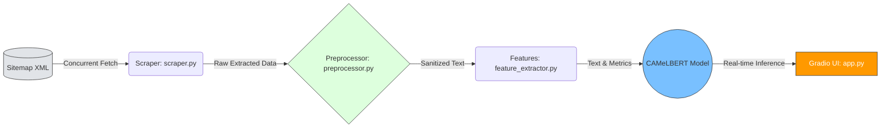

<p align="center">
  
</p>
 
<h1 align="center">🤖 Arabic News Scraper & NLP Pipeline</h1>

<p align="center">
  <strong>نظام متكامل لاستخراج وتصنيف الأخبار العربية باستخدام معالجة اللغات الطبيعية ونماذج الـ Transformers</strong>
</p>

<p align="center">
  <a href="https://huggingface.co/spaces/Alhareth/arabic-news-classifier">
    
  </a>
  <a href="https://github.com/Alhareith/arabic-news-classifier/stargazers">
    
  </a>
  <a href="https://github.com/Alhareith/arabic-news-classifier/network/members">
    
  </a>
</p>

<p align="center">
  
  
  
  
  
  
</p>

--- 

## ⚡ لمحة سريعة | Overview

<table align="right" dir="rtl" width="100%">
  <thead>
    <tr>
      <th align="right" width="25%">الميزة</th>
      <th align="right" width="75%">التفاصيل التقنية</th>
    </tr>
  </thead>
  <tbody>
    <tr>
      <td><b>النموذج اللغوي (Model)</b></td>
      <td>نموذج لغوي متطور ومُعدَّل لمهام التصنيف متعدد الفئات (<code>CAMeLBERT</code>)</td>
    </tr>
    <tr>
      <td><b>الأداء (Performance)</b></td>
      <td>دقة إجمالية تصل إلى <b>82.33%</b> بمقياس مكافئ قدره <b>81.56%</b> (<code>F1-Macro</code>)</td>
    </tr>
    <tr>
      <td><b>حجم البيانات (Dataset)</b></td>
      <td><b>41,435</b> مقالة إخبارية عربية جُمعت آلياً وخضعت لعمليات تنظيف مكثفة</td>
    </tr>
    <tr>
      <td><b>البنية والتشغيل (Infrastructure)</b></td>
      <td>خط إنتاج بيانات متزامن وعالي الأداء مدمج مع واجهة مستخدم حية عبر <code>Gradio</code></td>
    </tr>
    <tr>
      <td><b>الترخيص (License)</b></td>
      <td>رخصة <code>MIT</code> مفتوحة المصدر ومتاحة للاستخدام والتطوير الحر</td>
    </tr>
  </tbody>
</table>

<br><br><br><br><br><br><br><br><br><br>

<div align="right" dir="rtl">

> **🎯 الهدف الاستراتيجي:** بناء خط إنتاج بيانات (Data Pipeline) آمن وقابل للتوسع، يدمج بين تقنيات كشط البيانات عالي الأداء وممارسات معالجة النصوص العربية (Arabic NLP) لخدمة تطبيقات الذكاء الاصطناعي محلياً وعالمياً.

</div>


## 🏗️ البنية المعمارية | Architecture

<div align="right" dir="rtl">

يتميز خط الإنتاج بتصميم هندسي منفصل (Decoupled Pipeline) يضمن الاستقرار، سرعة المعالجة، والقابلية للتوسع:

| الطبقة | المكون | الوصف التقني |
|:---|:---|:---|
| **الاستخراج** | `scraper.py` | معالجة متزامنة عبر `ThreadPoolExecutor` (10 وحدات) مع تأخير عشوائي لتجنب حظر الـ IP |
| **التنقية** | `preprocessor.py` | استخراج هيكلي ذكي من `JSON-LD` + تنظيف نصوص عربية بـ RegEx مخصص |
| **الهندسة** | `feature_extractor.py` | مقاييس لسانية (Flesch-Kincaid مُعَرَّب) + إحصائيات توكنز عبر NLTK |
| **التهيئة** | `config.py` | إعدادات مركزية + تسجيل موحد + معالجة أخطاء شاملة |

</div>

### 🔄 مخطط تدفق البيانات الأساسي (Core Data Flow)


## 📈 تطور النموذج والمقاييس | Model Evolution & Fine-Tuning

<div align="right" dir="rtl">

تم تدريب نموذج `CAMeLBERT` لتصنيف متعدد الفئات بمنهجية **التدريب الذاتي (Self-Training / Pseudo-Labeling)**، مما ضاعف البيانات آلياً من 3,000 إلى **41,435 مقالة** دون توسيم يدوي مكلف:

| الإصدار | حجم البيانات | المنهجية | F1-Macro | الدقة |
|:---|:---|:---|:---:|:---:|
| **v1** *(Baseline)* | 3,000 مقالة *Golden* | توسيم يدوي لخط الأساس | — | — |
| **v2** *(Current ✅)* | **41,435** مقالة *Silver + Golden* | دمج الذهبية مع بيانات فضية (ثقة > 75%)، استبعاد ~18% من التصنيفات الأولية | **81.56%** | **82.33%** |

### 📊 تحليل الأداء حسب الفئة

| الفئة | الدقة | الاستدعاء | F1 |
|:---|:---:|:---:|:---:|
| 🏛️ سياسة | 0.86 | 0.84 | **0.85** |
| 📈 اقتصاد | 0.82 | 0.79 | **0.80** |
| ⚽ رياضة | 0.91 | 0.93 | **0.92** |
| 💻 تكنولوجيا | 0.78 | 0.76 | **0.77** |
| 🩺 صحة | 0.80 | 0.81 | **0.80** |

> 🔍 **الملاحظة التحليلية:** الفئات التخصصية (تكنولوجيا) أظهرت تحديات أكبر بسبب تنوع المصطلحات — فرصة تحسين مستقبلية عبر زيادة بيانات هذه الفئة.

</div>

---

> 💡 **لماذا F1-Macro؟**
>
> <div align="right" dir="rtl">
>
> الفئات الإخبارية غير متوازنة. `F1-Macro` يُقيّم جميع الفئات بالتساوي — لا الفئات المهيمنة فقط — مما يضمن تقييماً عادلاً لقدرة النموذج على فهم جميع المجالات.
>
> </div>

---


## 📁 Repository Blueprint
## 📁 الهيكلية المعمارية للمشروع | Repository Blueprint

<div align="right" dir="rtl">

صُمم هذا المستودع بهندسة **الكود النظيف (Clean Architecture)** ليُعامَل كحزمة بايثون قابلة للاستيراد (Installable Package)، مفصولة تماماً عن بيئات التجارب (Notebooks) والبيانات الضخمة:

</div>

```text
arabic-news-scraper/
├── 📦 src/                         # ❖ النواة الهندسية (Core Engine)
│   ├── 🖥️ app.py                   # واجهة Gradio التفاعلية (متصلة بـ Hugging Face Hub)
│   ├── ⚙️ config.py                # الإعدادات المركزية ونظام الـ Logging الهيكلي
│   ├── 🕸️ scraper.py               # محرك السحب المتزامن (ThreadPoolExecutor + Jitter)
│   ├── 🧹 preprocessor.py          # خوارزميات التنقية واستخراج JSON-LD الذكي
│   └── 📐 feature_extractor.py     # استخراج الخصائص اللسانية (NLP Metrics & Readability)
│
├── 📓 notebooks/                   # سجلات التطوير وتجارب EDA (تحليل استكشافي)
├── 💾 data/                        # بيئة تخزين البيانات (مستثناة من Git للحفاظ على الحجم)
├── 📋 requirements.txt             # الاعتماديات البرمجية (مثبتة بدقة بالإصدارات)
└── 📄 README.md                    # التوثيق المعماري الشامل (هذا الملف)
```

---

## ⚡ التشغيل الفوري والإعداد | Zero-Friction Setup

<div align="right" dir="rtl">

لن تحتاج لأكثر من دقيقتين لتشغيل المشروع محلياً. اتبع التسلسل الذهبي التالي (تم استخدام بيئة افتراضية للحفاظ على استقرار الحزم):

<b>🐍 1. استنساخ وتهيئة البيئة (Environment Initialization)</b>

</div>

```bash
# استنساخ المستودع
git clone [https://github.com/Alhareith/arabic-news-scraper.git](https://github.com/Alhareith/arabic-news-scraper.git)
cd arabic-news-scraper

# إنشاء وتفعيل بيئة افتراضية (أفضل ممارسة هندسية)
python -m venv venv
source venv/bin/activate   # لنظام Linux / Mac
# .\venv\Scripts\activate  # لنظام Windows (CMD)

# تثبيت جميع الاعتماديات دفعة واحدة
pip install --upgrade pip
pip install -r requirements.txt
```

<div align="right" dir="rtl">

<b>🎯 2. سيناريوهات التشغيل العملية (Run Scenarios)</b><br>
اختر السيناريو المناسب لاحتياجك:

<table width="100%">
  <thead>
    <tr>
      <th align="right" width="30%">المشهد</th>
      <th align="left" width="30%">الأمر / الكود</th>
      <th align="right" width="40%">النتيجة المتوقعة</th>
    </tr>
  </thead>
  <tbody>
    <tr>
      <td>🖥️ <b>تشغيل الواجهة التفاعلية (Gradio)</b></td>
      <td align="left"><code>python src/app.py</code></td>
      <td>فتح رابط محلي لاختبار التصنيف الحي للنموذج.</td>
    </tr>
    <tr>
      <td>📡 <b>الاستخدام البرمجي (API Integration)</b></td>
      <td align="left"><code>python -c "from src..."</code></td>
      <td>استدعاء دوال السحب والتحليل داخل أنظمة خلفية (Backend).</td>
    </tr>
    <tr>
      <td>🧪 <b>تجربة سريعة (5 مقالات فقط)</b></td>
      <td align="left"><i>انظر الكود أدناه</i></td>
      <td>سحب 5 مقالات، تنظيفها، وعرض التحليل اللغوي فوراً.</td>
    </tr>
  </tbody>
</table>

<b>💻 3. كود تجريبي جاهز للنسخ (Copy-Paste Ready)</b><br>
انسخ هذا المقتطف البرمجي في ملف <code>test_run.py</code> لتجربة خط الأنابيب الكامل (سحب + تنظيف + تحليل) فوراً:

</div>

```python
# test_run.py
from src.scraper import fetch_sitemap_urls, run_concurrent_pipeline
from src.feature_extractor import compute_text_features

# 1. جلب أحدث 5 روابط مقالات من موقع "سبق" الإخباري
print("⏳ جاري جلب الروابط...")
urls = fetch_sitemap_urls("[https://sabq.org/sitemap.xml](https://sabq.org/sitemap.xml)")[:5]

# 2. تنفيذ السحب المتزامن متعدد الخيوط
print(f"⏳ جاري سحب {len(urls)} مقالة...")
articles = run_concurrent_pipeline(urls)

# 3. استخراج الميزات اللغوية لأول مقالة
if articles:
    first_article = articles[0]
    analytics = compute_text_features(first_article["cleaned_text"])
    
    print("\n✅ تم السحب بنجاح!")
    print(f"📰 العنوان: {first_article.get('title', 'بدون عنوان')}")
    print(f"📊 عدد الكلمات: {analytics.get('word_count')}")
    print(f"📈 مؤشر الصعوبة (Flesch): {analytics.get('flesch_score')}")
```

---

## 🏁 الخلاصة الهندسية والترخيص | Final Takeaways & License

<div align="right" dir="rtl">

يهدف هذا المشروع إلى تقديم أكثر من مجرد كود؛ إنه نموذج حي لهندسة البيانات الاحترافية (Production-Grade Data Engineering):

* ⚖️ **التزامن المهذب (Polite Concurrency):** تم ضبط `max_workers=10` مع تأخيرات عشوائية (Jitter) لضمان سحب البيانات دون التسبب في حظر الخوادم أو انتهاك سياسات `robots.txt`.
* 🧩 **جاهزية التوسع (Enterprise Scalability):** الهيكلية المفصولة (Decoupled Modules) تسمح بتغليف المشروع باستخدام `Docker` أو نشره كـ Microservice مع FastAPI دون تعديل النواة.
* 📜 **الترخيص:** جميع مكونات هذا النظام مفتوحة المصدر بالكامل وتندرج تحت رخصة **MIT License**، مما يمنحك الحرية الكاملة للاستخدام التجاري والأكاديمي.

> 💡 **نصيحة الخبير:** لضمان نجاح تجربة التشغيل، تأكد من أن ملف `requirements.txt` يحتوي على إصدارات محددة (مثل `torch==2.0.1`) لتجنب أي تعارض مستقبلي. كما يُنصح بتشغيل الأمر `python src/app.py` مباشرة بعد التثبيت لاختبار الواجهة قبل الغوص في الكود البرمجي.

</div>

🛠️ Technology Stack
Core Language: Python 3.10+

Concurrency Engine: Concurrent Futures (ThreadPoolExecutor)

Data Mining: BeautifulSoup4, Requests, XML ElementTree Parsing

NLP & Feature Engineering: NLTK, Textstat, Pandas

Deployment & UI: Hosted live via Gradio on Hugging Face Spaces

⚙️ Execution Sandbox (How to Run)
Follow these streamlined steps to clone, configure, and execute the production pipeline on your local architecture:

1. Download and Clone the Project
Clone the repository from GitHub and navigate into the root project directory:

Bash
git clone [https://github.com/Alhareth/arabic-news-scraper.git](https://github.com/Alhareth/arabic-news-scraper.git)
cd arabic-news-scraper
2. Environment Specifications Setup
Install all required third-party libraries and NLP dependencies written in the standard configuration file using pip:

Bash
pip install -r requirements.txt
3. Practical Code Execution Sample
You can now programmatically import the core pipeline engines directly into any custom script to scrape and extract features dynamically:

Python
from src.scraper import fetch_sitemap_urls, run_concurrent_pipeline
from src.feature_extractor import compute_text_features

# 1. Fetch historical article sub-sitemaps dynamically
target_urls = fetch_sitemap_urls("[https://sabq.org/sitemap.xml](https://sabq.org/sitemap.xml)")[:20]

# 2. Execute the multi-threaded production crawling run (Extracting 20 articles)
scraped_dataset = run_concurrent_pipeline(target_urls)

# 3. Compute structural NLP metrics on any extracted text sample
if scraped_dataset:
    sample_text = scraped_dataset[0]["cleaned_text"]
    analytics = compute_text_features(sample_text)
    print("Linguistic Analytics Output:", analytics)
📝 Key Engineering Takeaways
polite Scraping Boundaries: Optimized the concurrency workload (max_workers=10) combined with automated random jitter delays to prevent trigger-based firewall blockages.

Deterministic Data Integrity: Mitigated structural text variations by tracking metadata patterns inside JavaScript injection points (application/ld+json), stabilizing data acquisition success rates.

Enterprise Integration: Structured the code natively into functional packages (src/) making it production-ready and fully importable by external applications or backend APIs.

📄 License
This system architecture and code deployment pipelines are completely open-sourced under the MIT License.
=======
# arabic-news-classifier
Arabic news classification using CAMeLBERT transformer. Fine-tuned for multi-class text classification of Arabic news article
>>>>>>> c0654cd36b23176980c789077f49346637bb00f4
