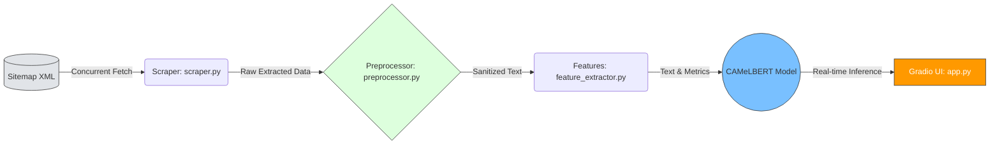

<h1 align="center">🤖 Arabic News Scraper & NLP Pipeline</h1>

<p align="center">
  <strong>نظام متكامل لاستخراج وتصنيف الأخبار العربية باستخدام معالجة اللغات الطبيعية ونماذج الـ Transformers</strong>
</p>  
   
<p align="center">
  <a href="https://huggingface.co/spaces/Alhareth/arabic-news-classifier">
    
  </a>
  <a href="https://github.com/Alhareith/arabic-news-classifier/stargazers">
    
  </a>
  <a href="https://github.com/Alhareith/arabic-news-classifier/network/members">
    
  </a>
</p>

<p align="center">
  
  
  
  
  
  
</p>

--- 

## ⚡ لمحة سريعة | Overview

<table align="right" dir="rtl" width="100%">
  <thead>
    <tr>
      <th align="right" width="25%">الميزة</th>
      <th align="right" width="75%">التفاصيل التقنية</th>
    </tr>
  </thead>
  <tbody>
    <tr>
      <td><b>النموذج اللغوي (Model)</b></td>
      <td>نموذج لغوي متطور ومُعدَّل لمهام التصنيف متعدد الفئات (<code>CAMeLBERT</code>)</td>
    </tr>
    <tr>
      <td><b>الأداء (Performance)</b></td>
      <td>دقة إجمالية تصل إلى <b>82.33%</b> بمقياس مكافئ قدره <b>81.56%</b> (<code>F1-Macro</code>)</td>
    </tr>
    <tr>
      <td><b>حجم البيانات (Dataset)</b></td>
      <td><b>41,435</b> مقالة إخبارية عربية جُمعت آلياً وخضعت لعمليات تنظيف مكثفة</td>
    </tr>
    <tr>
      <td><b>البنية والتشغيل (Infrastructure)</b></td>
      <td>خط إنتاج بيانات متزامن وعالي الأداء مدمج مع واجهة مستخدم حية عبر <code>Gradio</code></td>
    </tr>
    <tr>
      <td><b>الترخيص (License)</b></td>
      <td>رخصة <code>MIT</code> مفتوحة المصدر ومتاحة للاستخدام والتطوير الحر</td>
    </tr>
  </tbody>
</table>

<br><br><br><br><br><br><br><br><br><br>

<div align="right" dir="rtl">

> **🎯 الهدف الاستراتيجي:** بناء خط إنتاج بيانات (Data Pipeline) آمن وقابل للتوسع، يدمج بين تقنيات كشط البيانات عالي الأداء وممارسات معالجة النصوص العربية (Arabic NLP) لخدمة تطبيقات الذكاء الاصطناعي محلياً وعالمياً.

</div>


## 🏗️ البنية المعمارية | Architecture

<div align="right" dir="rtl">

يتميز خط الإنتاج بتصميم هندسي منفصل (Decoupled Pipeline) يضمن الاستقرار، سرعة المعالجة، والقابلية للتوسع:

| الطبقة | المكون | الوصف التقني |
|:---|:---|:---|
| **الاستخراج** | `scraper.py` | معالجة متزامنة عبر `ThreadPoolExecutor` (10 وحدات) مع تأخير عشوائي لتجنب حظر الـ IP |
| **التنقية** | `preprocessor.py` | استخراج هيكلي ذكي من `JSON-LD` + تنظيف نصوص عربية بـ RegEx مخصص |
| **الهندسة** | `feature_extractor.py` | مقاييس لسانية (Flesch-Kincaid مُعَرَّب) + إحصائيات توكنز عبر NLTK |
| **التهيئة** | `config.py` | إعدادات مركزية + تسجيل موحد + معالجة أخطاء شاملة |

</div>

### 🔄 مخطط تدفق البيانات الأساسي (Core Data Flow)


## 📈 تطور النموذج والمقاييس | Model Evolution & Fine-Tuning

<div align="right" dir="rtl">

تم تدريب نموذج `CAMeLBERT` لتصنيف متعدد الفئات بمنهجية **التدريب الذاتي (Self-Training / Pseudo-Labeling)**، مما ضاعف البيانات آلياً من 3,000 إلى **41,435 مقالة** دون توسيم يدوي مكلف:

| الإصدار | حجم البيانات | المنهجية | F1-Macro | الدقة |
|:---|:---|:---|:---:|:---:|
| **v1** *(Baseline)* | 3,000 مقالة *Golden* | توسيم يدوي لخط الأساس | — | — |
| **v2** *(Current ✅)* | **41,435** مقالة *Silver + Golden* | دمج الذهبية مع بيانات فضية (ثقة > 75%)، استبعاد ~18% من التصنيفات الأولية | **81.56%** | **82.33%** |

### 📊 تحليل الأداء حسب الفئة

| الفئة | الدقة | الاستدعاء | F1 |
|:---|:---:|:---:|:---:|
| 🏛️ سياسة | 0.86 | 0.84 | **0.85** |
| 📈 اقتصاد | 0.82 | 0.79 | **0.80** |
| ⚽ رياضة | 0.91 | 0.93 | **0.92** |
| 💻 تكنولوجيا | 0.78 | 0.76 | **0.77** |
| 🩺 صحة | 0.80 | 0.81 | **0.80** |

> 🔍 **الملاحظة التحليلية:** الفئات التخصصية (تكنولوجيا) أظهرت تحديات أكبر بسبب تنوع المصطلحات — فرصة تحسين مستقبلية عبر زيادة بيانات هذه الفئة.

</div>

---

> 💡 **لماذا F1-Macro؟**
>
> <div align="right" dir="rtl">
>
> الفئات الإخبارية غير متوازنة. `F1-Macro` يُقيّم جميع الفئات بالتساوي — لا الفئات المهيمنة فقط — مما يضمن تقييماً عادلاً لقدرة النموذج على فهم جميع المجالات.
>
> </div>

---


## 📁 Repository Blueprint
## 📁 الهيكلية المعمارية للمشروع | Repository Blueprint

<div align="right" dir="rtl">

صُمم هذا المستودع بهندسة **الكود النظيف (Clean Architecture)** ليُعامَل كحزمة بايثون قابلة للاستيراد (Installable Package)، مفصولة تماماً عن بيئات التجارب (Notebooks) والبيانات الضخمة:

</div>

```text
arabic-news-classifier/
├── 📦 src/                         # ❖ النواة الهندسية (Core Engine)
│   ├── 🖥️ app.py                   # واجهة Gradio التفاعلية (متصلة بـ Hugging Face Hub)
│   ├── ⚙️ config.py                # الإعدادات المركزية ونظام الـ Logging الهيكلي
│   ├── 🕸️ scraper.py               # محرك السحب المتزامن (ThreadPoolExecutor + Jitter)
│   ├── 🧹 preprocessor.py          # خوارزميات التنقية واستخراج JSON-LD الذكي
│   └── 📐 feature_extractor.py     # استخراج الخصائص اللسانية (NLP Metrics & Readability)
│
├── 📓 notebooks/                   # سجلات التطوير وتجارب EDA (تحليل استكشافي)
├── 💾 data/                        # بيئة تخزين البيانات (مستثناة من Git للحفاظ على الحجم)
├── 📋 requirements.txt             # الاعتماديات البرمجية (مثبتة بدقة بالإصدارات)
└── 📄 README.md                    # التوثيق المعماري الشامل (هذا الملف)
```

---
## ⚡ التشغيل الفوري والإعداد | Zero-Friction Setup

<div align="right" dir="rtl">

لن تحتاج لأكثر من **دقيقتين** لتشغيل المشروع محلياً. اتبع التسلسل الذهبي التالي (تم استخدام بيئة افتراضية للحفاظ على استقرار الحزم):

</div>

### 🐍 1. استنساخ وتهيئة البيئة (Environment Initialization)

```bash
# استنساخ المستودع
git clone https://github.com/Alhareith/arabic-news-classifier.git
cd arabic-news-classifier

# إنشاء وتفعيل بيئة افتراضية (أفضل ممارسة هندسية)
python -m venv venv
source venv/bin/activate   # لنظام Linux / Mac
# .\venv\Scripts\activate  # لنظام Windows (CMD)

# تثبيت جميع الاعتماديات دفعة واحدة
pip install --upgrade pip
pip install -r requirements.txt
```

### 🎯 2. سيناريوهات التشغيل العملية (Run Scenarios)

<div align="right" dir="rtl">

اختر السيناريو المناسب لاحتياجك:

</div>

| المشهد | الأمر / الكود | النتيجة المتوقعة |
| :--- | :--- | :--- |
| **🖥️ تشغيل الواجهة التفاعلية (Gradio)** | `python src/app.py` | فتح رابط محلي (مثل `http://127.0.0.1:7860`) لاختبار التصنيف الحي للنموذج. |
| **📡 الاستخدام البرمجي (API Integration)** | `python -c "from src.scraper import ..."` | استدعاء دوال السحب والتحليل داخل أنظمة خلفية (Backend) مباشرة. |
| **🧪 تجربة سريعة (5 مقالات فقط)** | انظر الكود أدناه | سحب 5 مقالات، تنظيفها، وعرض التحليل اللغوي فوراً دون عناء. |

---

### 💻 3. كود تجريبي جاهز للنسخ (Copy-Paste Ready)

<div align="right" dir="rtl">

انسخ هذا المقتطف البرمجي في ملف `test_run.py` لتجربة خط الأنابيب الكامل (سحب + تنظيف + تحليل) فوراً:

</div>

```python
# test_run.py
from src.scraper import fetch_sitemap_urls, run_concurrent_pipeline
from src.feature_extractor import compute_text_features

# 1. جلب أحدث 5 روابط مقالات من موقع "سبق" الإخباري
print("⏳ جاري جلب الروابط...")
urls = fetch_sitemap_urls("https://sabq.org/sitemap.xml")[:5]

# 2. تنفيذ السحب المتزامن متعدد الخيوط
print(f"⏳ جاري سحب {len(urls)} مقالة...")
articles = run_concurrent_pipeline(urls)

# 3. استخراج الميزات اللغوية لأول مقالة
if articles:
    first_article = articles[0]
    analytics = compute_text_features(first_article["cleaned_text"])
    
    print("\n✅ تم السحب بنجاح!")
    print(f"📰 العنوان: {first_article.get('title', 'بدون عنوان')}")
    print(f"📊 عدد الكلمات: {analytics.get('word_count', 0)}")
    print(f"📈 مؤشر الصعوبة (Flesch): {analytics.get('flesch_score', 0)}")
```
---
# 1. Fetch historical article sub-sitemaps dynamically
target_urls = fetch_sitemap_urls("[https://sabq.org/sitemap.xml](https://sabq.org/sitemap.xml)")[:20]

