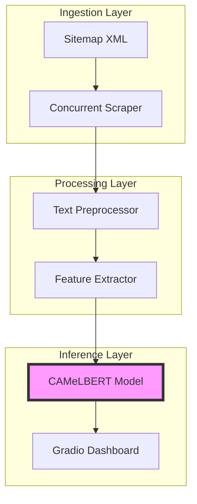

<p align="center">
  
</p>
<p align="center">
  
  
  
</p>

<p align="center">
  <b>End-to-End System</b> لاستخراج وتصنيف الأخبار العربية باستخدام <b>Advanced NLP</b> ونماذج <b>State-of-the-Art Transformers</b>
</p>

<p align="center">
  <a href="#-core-features">Features</a> •
  <a href="#-tech-stack">Tech Stack</a> •
  <a href="#-architecture">Architecture</a> •
  <a href="#-quick-start">Quick Start</a> •
  <a href="#-roadmap">Roadmap</a>
</p>

---

## 🚀 Overview | نظرة عامة

هذا المشروع ليس مجرد Scraper عادي، بل هو **Complete Data Pipeline** مصمم للتعامل مع ضخامة البيانات الإخبارية العربية. نستخدم فيه **Concurrent Scraping** لضمان السرعة، متبوعاً بمرحلة **Preprocessing** مكثفة لتنظيف النصوص، وصولاً إلى **Real-time Inference** باستخدام أقوى نماذج اللغة العربية.

---

## ✨ Core Features | الميزات الجوهرية

<table width="100%">
  <tr>
    <td width="50%">
      <h3>🔍 Smart Scraping</h3>
      <ul>
        <li><b>Multi-threaded Execution</b> باستخدام <code>ThreadPoolExecutor</code>.</li>
        <li>دعم الـ <b>Sitemap XML Parsing</b> لاستكشاف الروابط تلقائياً.</li>
        <li>نظام <b>Robust Retry Mechanism</b> مع Jitter لتجنب الحظر.</li>
      </ul>
    </td>
    <td width="50%">
      <h3>🧠 Deep Learning NLP</h3>
      <ul>
        <li><b>Fine-tuned CAMeLBERT</b> للحصول على أدق تصنيف للفئات.</li>
        <li>دعم الـ <b>Multi-class Classification</b> (سياسة، اقتصاد، رياضة...).</li>
        <li>معالجة <b>Self-Training</b> لزيادة دقة الـ Silver Data.</li>
      </ul>
    </td>
  </tr>
  <tr>
    <td width="50%">
      <h3>🧹 Advanced Preprocessing</h3>
      <ul>
        <li>استخراج المحتوى النظيف وإزالة الـ <b>Boilerplate</b> والإعلانات.</li>
        <li><b>Arabic Text Normalization</b> (توحيد الهمزات، إزالة التشكيل).</li>
        <li>استخراج الـ <b>Metadata</b> والـ JSON-LD من الصفحات.</li>
      </ul>
    </td>
    <td width="50%">
      <h3>📊 Analytics & UI</h3>
      <ul>
        <li><b>Feature Extraction</b> لحساب الـ Word Count و Readability Scores.</li>
        <li>واجهة <b>Gradio Web UI</b> تفاعلية وسهلة الاستخدام.</li>
        <li>جاهز للـ <b>Deployment</b> الفوري على HuggingFace Spaces.</li>
      </ul>
    </td>
  </tr>
</table>

---

## 🛠 Tech Stack | المزيج التقني

| Category | Tools & Technologies |
| :--- | :--- |
| **Language** |  |
| **Deep Learning** |   |
| **Data Scraping** | `BeautifulSoup4`, `Requests`, `Concurrent.futures` |
| **Web Interface** |  |
| **Architecture** | Clean Architecture, Modular Design |

---

## 🏗 Architecture | البنية المعمارية

### 🔄 Core Data Flow
يتبع المشروع مساراً هندسياً دقيقاً لضمان جودة البيانات (**Data Integrity**):



---

## 📈 Model Performance | أداء النموذج

| Metric | Score | Status |
| :--- | :--- | :--- |
| **Accuracy** | `82.33%` | ✅ Stable |
| **F1-Macro** | `81.56%` | ✅ Optimized |
| **Dataset Size** | `41,435` | 📚 Golden + Silver |

---

## 📁 Repository Structure | هيكلية المشروع

```bash
arabic-news-classifier/
├── src/
│   ├── app.py            # Gradio Interface & Entry Point
│   ├── scraper.py        # High-performance Scraping Engine
│   ├── preprocessor.py   # Text Cleaning & Normalization
│   └── feature_extractor.py # Linguistic Metrics Extraction
├── notebooks/            # EDA & Model Training Experiments
└── requirements.txt      # Dependency Management
```

---

## ⚡ Quick Start | التشغيل السريع

### 1️⃣ Environment Setup
قم بتهيئة الـ **Virtual Environment** وتثبيت الـ **Dependencies**:
```bash
git clone https://github.com/Alhareith/arabic-news-classifier.git
cd arabic-news-classifier
python -m venv venv
source venv/bin/activate  # Windows: .\venv\Scripts\activate
pip install -r requirements.txt
```

### 2️⃣ Run Dashboard
لتشغيل الـ **Local Web Server** وعرض الواجهة:
```bash
python src/app.py
```

---

## 🔮 Roadmap | التطلعات المستقبلية

- [ ] 🧪 **Unit Testing:** تغطية شاملة باستخدام `pytest`.
- [ ] ⚙️ **CI/CD Pipeline:** أتمتة الاختبارات عبر GitHub Actions.
- [ ] 🐳 **Dockerization:** توفير `Dockerfile` للنشر السحابي السهل.
- [ ] 📡 **API Integration:** بناء REST API باستخدام FastAPI.

---

## 🤝 Contributing | المساهمة

نحن نرحب بالـ **Pull Requests**! سواء كانت تحسينات في الـ **Scraping Logic** أو إضافة فئات تصنيف جديدة.
1. Fork المشروع.
2. Create الـ Feature Branch الخاص بك.
3. Submit الـ PR للمراجعة.

---

## 📜 License | الترخيص

هذا المشروع مرخص تحت **MIT License** - متاح للاستخدام الحر والتعديل.

---

<div align="center">
  <h3>Developed with ❤️ by Eng. Alhareith</h3>
  <p><i>Full-Stack AI & Data Engineering</i></p>
  
  <a href="https://github.com/Alhareith"></a>
  <a href="https://linkedin.com/in/YOUR_LINKEDIN_PROFILE"></a>
  <a href="mailto:YOUR_EMAIL@example.com"></a>
  
  <br>
  <a href="#-arabic-news-scraper--nlp-pipeline"><b>Back to Top ⬆️</b></a>
</div>
