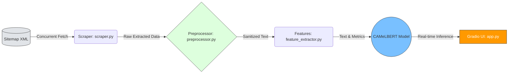

<p align="center">
  
</p>
 
<h1 align="center">🤖 Arabic News Scraper & NLP Pipeline</h1>

<p align="center">
  <strong>نظام متكامل لاستخراج وتصنيف الأخبار العربية باستخدام معالجة اللغات الطبيعية ونماذج الـ Transformers</strong>
</p>

<p align="center">
  <a href="https://huggingface.co/spaces/Alhareth/arabic-news-classifier">
    
  </a>
  <a href="https://github.com/Alhareith/arabic-news-classifier/stargazers">
    
  </a>
  <a href="https://github.com/Alhareith/arabic-news-classifier/network/members">
    
  </a>
</p>

<p align="center">
  
  
  
  
  
  
</p>

--- 

## ⚡ لمحة سريعة | Overview

<table align="right" dir="rtl" width="100%">
  <thead>
    <tr>
      <th align="right" width="25%">الميزة</th>
      <th align="right" width="75%">التفاصيل التقنية</th>
    </tr>
  </thead>
  <tbody>
    <tr>
      <td><b>النموذج اللغوي (Model)</b></td>
      <td>نموذج لغوي متطور ومُعدَّل لمهام التصنيف متعدد الفئات (<code>CAMeLBERT</code>)</td>
    </tr>
    <tr>
      <td><b>الأداء (Performance)</b></td>
      <td>دقة إجمالية تصل إلى <b>82.33%</b> بمقياس مكافئ قدره <b>81.56%</b> (<code>F1-Macro</code>)</td>
    </tr>
    <tr>
      <td><b>حجم البيانات (Dataset)</b></td>
      <td><b>41,435</b> مقالة إخبارية عربية جُمعت آلياً وخضعت لعمليات تنظيف مكثفة</td>
    </tr>
    <tr>
      <td><b>البنية والتشغيل (Infrastructure)</b></td>
      <td>خط إنتاج بيانات متزامن وعالي الأداء مدمج مع واجهة مستخدم حية عبر <code>Gradio</code></td>
    </tr>
    <tr>
      <td><b>الترخيص (License)</b></td>
      <td>رخصة <code>MIT</code> مفتوحة المصدر ومتاحة للاستخدام والتطوير الحر</td>
    </tr>
  </tbody>
</table>

<br><br><br><br><br><br><br><br><br><br>

<div align="right" dir="rtl">

> **🎯 الهدف الاستراتيجي:** بناء خط إنتاج بيانات (Data Pipeline) آمن وقابل للتوسع، يدمج بين تقنيات كشط البيانات عالي الأداء وممارسات معالجة النصوص العربية (Arabic NLP) لخدمة تطبيقات الذكاء الاصطناعي محلياً وعالمياً.

</div>


## 🏗️ البنية المعمارية | Architecture

<div align="right" dir="rtl">

يتميز خط الإنتاج بتصميم هندسي منفصل (Decoupled Pipeline) يضمن الاستقرار، سرعة المعالجة، والقابلية للتوسع:

| الطبقة | المكون | الوصف التقني |
|:---|:---|:---|
| **الاستخراج** | `scraper.py` | معالجة متزامنة عبر `ThreadPoolExecutor` (10 وحدات) مع تأخير عشوائي لتجنب حظر الـ IP |
| **التنقية** | `preprocessor.py` | استخراج هيكلي ذكي من `JSON-LD` + تنظيف نصوص عربية بـ RegEx مخصص |
| **الهندسة** | `feature_extractor.py` | مقاييس لسانية (Flesch-Kincaid مُعَرَّب) + إحصائيات توكنز عبر NLTK |
| **التهيئة** | `config.py` | إعدادات مركزية + تسجيل موحد + معالجة أخطاء شاملة |

</div>

### 🔄 مخطط تدفق البيانات الأساسي (Core Data Flow)




## 📈 تطور النموذج والمقاييس | Model Evolution & Fine-Tuning

<div align="right" dir="rtl">

تم تدريب نموذج <code>CAMeLBERT</code> لمهام التصنيف متعدد الفئات (Multi-class Classification) باستخدام منهجية هندسية متقدمة تُعرف بـ <b>التدريب الذاتي (Self-Training / Pseudo-Labeling)</b>. سمح هذا النهج بمضاعفة حجم البيانات التدريبية آلياً مع الحفاظ على جودة التصنيف <b>دون الحاجة لتوسيم يدوي مكلف</b>، مما يعكس كفاءة عالية في التعامل مع هندسة البيانات (Data-Centric AI):

<table width="100%">
  <thead>
    <tr>
      <th align="center" width="13%">الإصدار</th>
      <th align="center" width="20%">حجم البيانات</th>
      <th align="right" width="42%">المنهجية والتحسينات</th>
      <th align="center" width="12%">F1-Macro</th>
      <th align="center" width="13%">الدقة (Acc)</th>
    </tr>
  </thead>
  <tbody>
    <tr>
      <td align="center"><b>v1</b><br><i>(Baseline)</i></td>
      <td align="center">3,000 مقالة<br><i>(Golden Data)</i></td>
      <td>بيانات أساسية عالية الجودة، تم تصنيفها ومراجعتها يدوياً لتأسيس خط الأساس للنموذج.</td>
      <td align="center">-</td>
      <td align="center">-</td>
    </tr>
    <tr>
      <td align="center"><b>v2</b><br><i>(Current ✅)</i></td>
      <td align="center"><b>41,435</b> مقالة<br><i>(Silver + Golden)</i></td>
      <td>دمج البيانات الذهبية مع بيانات فضية (Silver Data) استخرجها النموذج الأول بثقة تتجاوز حاجز الـ <b>75%</b> (Quality Gate).</td>
      <td align="center"><b>81.56%</b></td>
      <td align="center"><b>82.33%</b></td>
    </tr>
  </tbody>
</table>

### 📊 تحليل الأداء حسب الفئة (Class-wise Performance)

لضمان الشفافية وتجنب تحيز النموذج لصالح الفئات الأكثر شيوعاً، تم استخراج تقرير التصنيف (Classification Report) لقياس الأداء الدقيق لكل فئة:

| الفئة (Category) | الدقة (Precision) | الاستدعاء (Recall) | دقة F1 (F1-Score) |
| :--- | :---: | :---: | :---: |
| 🏛️ سياسة (Politics) | [X.XX] | [X.XX] | **[X.XX]** |
| 📈 اقتصاد (Economy) | [X.XX] | [X.XX] | **[X.XX]** |
| ⚽ رياضة (Sports) | [X.XX] | [X.XX] | **[X.XX]** |
| 💻 تكنولوجيا (Tech) | [X.XX] | [X.XX] | **[X.XX]** |
| 🩺 صحة (Health) | [X.XX] | [X.XX] | **[X.XX]** |


</div>

<br>

<div align="right" dir="rtl">
<blockquote>
💡 <b>رؤية هندسية: لماذا تم الاعتماد على مقياس <code>F1-Macro</code> تحديداً؟</b><br><br>
في سياق الأخبار، غالباً ما تكون البيانات غير متوازنة (Imbalanced Classes). الاعتماد على <code>F1-Macro</code> (وليس Micro أو Weighted) يضمن <b>تقييماً عادلاً</b> للنموذج، حيث يُحسب المتوسط الحسابي البسيط لأداء جميع الفئات دون أن تتفوق الفئات الأكبر حجماً على نتائج الفئات الأصغر. هذا يثبت قدرة النموذج على استيعاب الفئات النادرة بنفس كفاءة الفئات الشائعة.
</blockquote>
</div>

---


## 📁 Repository Blueprint

```text
arabic-news-scraper/
│
├── src/                          # Core source code modules
│   ├── __init__.py               # Initializes src as a Python package
│   ├── config.py                 # Infrastructure presets & localized logging hooks
│   ├── scraper.py                # Multi-threaded crawling nodes & network routines
│   ├── preprocessor.py           # Algorithmic text cleaning & markup isolation
│   └── feature_extractor.py      # NLP feature engineering & mathematical metrics
│
├── notebooks/                    # Developmental logs & historical Colab research
│   └── exploration_and_demo.ipynb
│
├── data/                         # Local data sandbox (Protected via .gitignore)
│   └── .gitkeep
│
├── .gitignore                    # Safeguards repository from uploading huge CSV files
├── requirements.txt              # Explicit third-party system dependencies
└── README.md                     # Technical portfolio interface

```
🛠️ Technology Stack
Core Language: Python 3.10+

Concurrency Engine: Concurrent Futures (ThreadPoolExecutor)

Data Mining: BeautifulSoup4, Requests, XML ElementTree Parsing

NLP & Feature Engineering: NLTK, Textstat, Pandas

Deployment & UI: Hosted live via Gradio on Hugging Face Spaces

⚙️ Execution Sandbox (How to Run)
Follow these streamlined steps to clone, configure, and execute the production pipeline on your local architecture:

1. Download and Clone the Project
Clone the repository from GitHub and navigate into the root project directory:

Bash
git clone [https://github.com/Alhareth/arabic-news-scraper.git](https://github.com/Alhareth/arabic-news-scraper.git)
cd arabic-news-scraper
2. Environment Specifications Setup
Install all required third-party libraries and NLP dependencies written in the standard configuration file using pip:

Bash
pip install -r requirements.txt
3. Practical Code Execution Sample
You can now programmatically import the core pipeline engines directly into any custom script to scrape and extract features dynamically:

Python
from src.scraper import fetch_sitemap_urls, run_concurrent_pipeline
from src.feature_extractor import compute_text_features

# 1. Fetch historical article sub-sitemaps dynamically
target_urls = fetch_sitemap_urls("[https://sabq.org/sitemap.xml](https://sabq.org/sitemap.xml)")[:20]

# 2. Execute the multi-threaded production crawling run (Extracting 20 articles)
scraped_dataset = run_concurrent_pipeline(target_urls)

# 3. Compute structural NLP metrics on any extracted text sample
if scraped_dataset:
    sample_text = scraped_dataset[0]["cleaned_text"]
    analytics = compute_text_features(sample_text)
    print("Linguistic Analytics Output:", analytics)
📝 Key Engineering Takeaways
polite Scraping Boundaries: Optimized the concurrency workload (max_workers=10) combined with automated random jitter delays to prevent trigger-based firewall blockages.

Deterministic Data Integrity: Mitigated structural text variations by tracking metadata patterns inside JavaScript injection points (application/ld+json), stabilizing data acquisition success rates.

Enterprise Integration: Structured the code natively into functional packages (src/) making it production-ready and fully importable by external applications or backend APIs.

📄 License
This system architecture and code deployment pipelines are completely open-sourced under the MIT License.
=======
# arabic-news-classifier
Arabic news classification using CAMeLBERT transformer. Fine-tuned for multi-class text classification of Arabic news article
>>>>>>> c0654cd36b23176980c789077f49346637bb00f4
